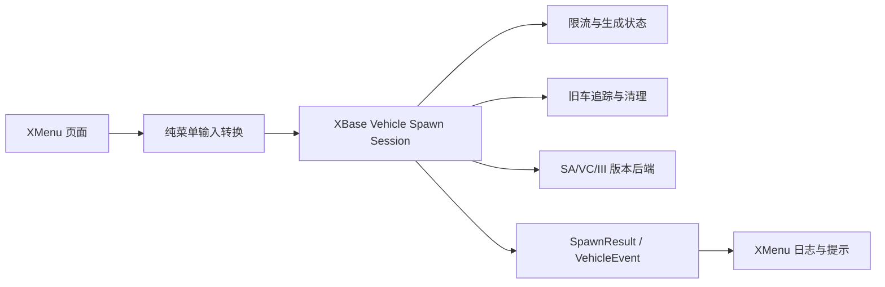

## 选择静态库

XBase 按 GTA 版本生成独立静态库：

| 目标 | 库 | plugin-sdk |
|---|---|---|
| SA | `XBaseSA.lib` | `plugin_sa` |
| VC | `XBaseVC.lib` | `plugin_vc` |
| III | `XBaseIII.lib` | `plugin_III` |

一个 payload 只能链接一个目标库。不要使用库文件名、头文件或宏把 SA ABI 混入 VC/III。

## 生命周期

宿主负责生命周期，推荐顺序如下：

```cpp
XBase::Log::Init();
const auto domains =
    XBase::Core::DomainBit(XBase::Core::Domain::Player) |
    XBase::Core::DomainBit(XBase::Core::Domain::Ped) |
    XBase::Core::DomainBit(XBase::Core::Domain::Vehicle);

// SA 可按能力启用额外领域；VC/III 只启用当前库真实支持的领域。
XBase::Core::Init(domains);

// 游戏完成 initGame 后；会重置领域对象快照和运行时状态。
XBase::Core::NotifyGameInit();

// 每帧只调用 Core，一次性分发到已启用领域。
XBase::Core::Process();

// 卸载前恢复控制器状态。
XBase::Core::Shutdown();
```

如果宿主自己负责 D3D/ImGui，则不要同时调用 `XBase::Hooks::Init()` 和 `XBase::UI::Init()`，避免重复安装 Hook 或创建第二套 ImGui context。

## 能力检查

领域能力只表示至少存在一组真实 backend。页面应优先检查细粒度能力：

```cpp
if (!XBase::HasCapability(XBase::FeatureCapability::PlayerBasicState)) {
    // 禁用对应 UI 或显示“不支持当前版本”
    return;
}
```

Player、Ped、Vehicle 的对象级基础能力当前由对应版本后端分别报告。World、Weapon、Scene、Teleport、Visual、BulletAssist 的已迁移能力目前只在 SA 报告可用；VC/III 未确认的能力必须保持 `false`。能力为 `false` 时，宿主不得继续调用对应功能。

VC/III 对未确认的功能不应被启用。若构建中仍包含兼容性桩，它们只用于保持公共头文件的链接边界，不能被当作功能实现；能力查询是唯一支持性依据。VC/III 的 `SetEnabledDomains()` 会过滤未支持领域，`GetEnabledDomains()` 返回实际生效掩码。

## XMenu 集成边界


页面只负责输入和显示；游戏对象访问属于 XBase 后端。宿主先将菜单字段转换为 `XBase::Vehicle::SpawnOptions` 和 `SpawnPolicy`，再调用 XBase Vehicle session。XBase 负责模型校验、限流、生成、旧车追踪/清理、生命周期恢复和事件队列；XMenu 只负责菜单输入、结果展示以及交通/自动驾驶/版本专属策略。



`Vehicle::Process()`、`World::Process()`、`Weapon::Process()`、`Scene::Process()`、`Teleport::Process()`、`Visual::Process()` 和 `BulletAssist::Process()` 只能由 `Core::Process()` 调用。XMenu 不得再调用这些领域的持续处理入口；`ProcessHost()` 仅处理宿主策略和 UI 事件适配。


freecam、ESP、霓虹和随机作弊等 XMenu 专属扩展可以保留在 XMenu，但不得让 XBase 依赖 `MenuState`。