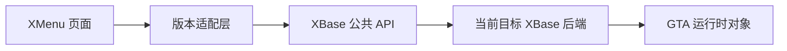
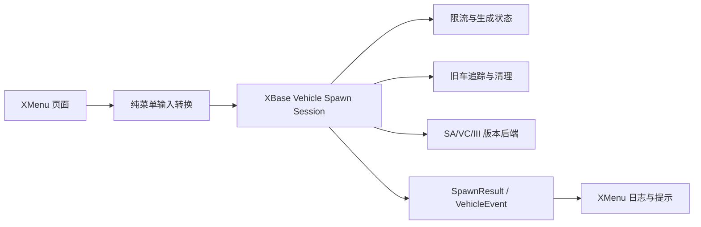

## 选择静态库

XBase 按 GTA 版本生成独立静态库：

| 目标 | 库 | plugin-sdk |
|---|---|---|
| SA | `XBaseSA.lib` | `plugin_sa` |
| VC | `XBaseVC.lib` | `plugin_vc` |
| III | `XBaseIII.lib` | `plugin_III` |

一个 payload 只能链接一个目标库。不要使用库文件名、头文件或宏把 SA ABI 混入 VC/III。

## 生命周期

宿主负责生命周期，推荐顺序如下：

```cpp
XBase::Log::Init();

void OnGameInit() {
    XBase::Core::NotifyGameInit();
}

void OnProcess() {
    XBase::Core::Process();
}

// 安装宿主事件回调；同时启用当前版本的运行时保护
XBase::Host::Install({OnGameInit, OnProcess});

const auto domains =
    XBase::Core::DomainBit(XBase::Core::Domain::Player) |
    XBase::Core::DomainBit(XBase::Core::Domain::Ped) |
    XBase::Core::DomainBit(XBase::Core::Domain::Vehicle);

// 掩码会过滤当前库不支持的领域
XBase::Core::Init(domains);

// 卸载前恢复控制器状态
XBase::Core::Shutdown();
XBase::Host::Shutdown();
```

`Host::Install()` 安装 `initGameEvent` 与进程事件订阅；`Host::Shutdown()` 会等待在途回调结束再解除订阅，并按逆序卸载运行时保护。

```cpp
bool Install(const Callbacks& callbacks);
void Shutdown();
bool IsInstalled();
bool ShowMessage(const char* message);
```

`ShowMessage()` 在当前版本用游戏内置帮助消息输出 UTF-8 文本；VC/III 内部转换为宽字符，不经过 ImGui。

运行时保护只在对应版本安装：VC 增加剧情资源目录纠正（`CDirectory::ReadDirFile`）与空文件句柄保护（`CFileMgr::Read` / `CloseFile`）；SA/VC 同时维护剧情期安全门，供 `BulletAssist` 在剧情、相机过渡与玩家不可用状态下停止对象访问。

如果宿主自己负责 D3D/ImGui，则不要同时调用 `XBase::Hooks::Init()` 和 `XBase::UI::Init()`，避免重复安装 Hook 或创建第二套 ImGui context。

## 能力检查

领域能力只表示至少存在一组真实 backend。页面应优先检查细粒度能力：

```cpp
if (!XBase::HasCapability(XBase::FeatureCapability::PlayerBasicState)) {
    // 禁用对应 UI 或显示“不支持当前版本”
    return;
}
```

各版本的实际支持情况以 `Capabilities.cpp` 与 README 能力矩阵为准；运行时行为以能力返回值唯一为准。SA 已收口全部领域；VC/III 只报告已实现的能力，未实现的能力保持 `false`。

能力为 `false` 时宿主不得继续调用对应功能。VC/III 的 `SetEnabledDomains()` 会过滤未支持领域，`GetEnabledDomains()` 返回实际生效掩码。

## XMenu 集成边界



页面只负责输入和显示；游戏对象访问属于 XBase 后端。宿主先将菜单字段转换为 `XBase::Vehicle::SpawnOptions` 和 `SpawnPolicy`，再调用 XBase Vehicle session。XBase 负责模型校验、限流、生成、旧车追踪/清理、生命周期恢复和事件队列；XMenu 只负责菜单输入、结果展示以及交通/自动驾驶/版本专属策略。



`Vehicle::Process()`、`World::Process()`、`Weapon::Process()`、`Scene::Process()`、`Teleport::Process()`、`Visual::Process()` 和 `BulletAssist::Process()` 只能由 `Core::Process()` 调用。XMenu 不得再调用这些领域的持续处理入口；`ProcessHost()` 仅处理宿主策略和 UI 事件适配。


自由视角、俯视相机、霓虹、随机作弊等曾属于宿主的功能已由 `Camera`、`VehicleEffects`、`Cheats` 提供，宿主不要重新引入对象访问；XMenu 只保留菜单状态、页面编排和输入转换，XBase 不依赖 `MenuState`。